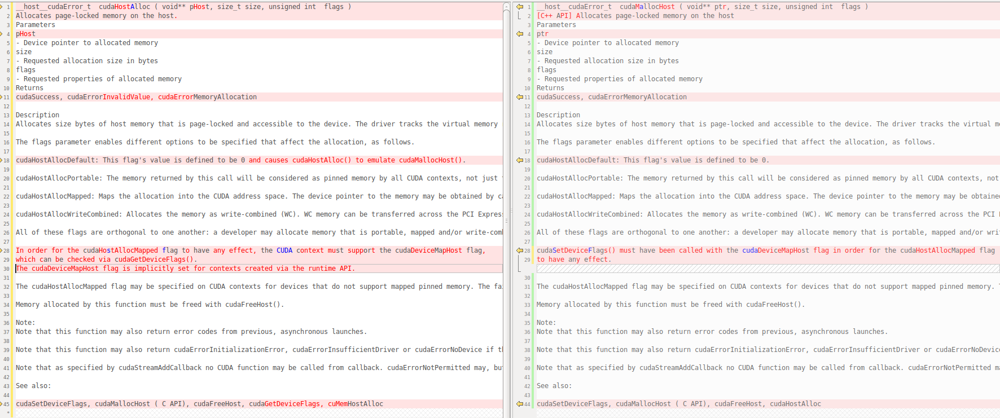

## cudaHostAlloc

```cpp
auto nbytes = data_size * sizeof(int);
if ((cudaHostAlloc((void **)&h_out_data, nbytes, cudaHostAllocMapped)) != 0){
    printf("ERROR, cudaHostAlloc in %s at line %d", __FILE__, __LINE__);
    return false;
}else{
    printf("cudaHostAlloc output buffer [%d] success!", nbytes);
}

cudaHostGetDevicePointer((void **)&d_out_data, (void *)h_out_data, 0);     
```          

```c
cudaError_t cudaHostAlloc	(void ** 	pHost,
                             size_t 	size,
                             unsigned int 	flags)	
```

**cudaHostAlloc** vs  **cudaMallocHost**        

     


## cudaHostRegister   
```cpp
__host__​cudaError_t cudaHostRegister ( void* ptr, size_t size, unsigned int  flags )   
Registers an existing host memory range for use by CUDA.
```

是否修改了ptr 空间的内容？  
ptr值没有改变   
```  
__host__​cudaError_t cudaHostAlloc ( void** pHost, size_t size, unsigned int  flags )   
Allocates page-locked memory on the host.<br>
Parameters   
pHost   
- Device pointer to allocated memory   
size   
- Requested allocation size in bytes  
flags  
- Requested properties of allocated memory   
Returns   
cudaSuccess, cudaErrorInvalidValue, cudaErrorMemoryAllocation  

Description
Allocates size bytes of host memory that is page-locked and accessible to the device. The driver tracks the virtual memory ranges allocated with this function and automatically accelerates calls to functions such as cudaMemcpy(). Since the memory can be accessed directly by the device, it can be read or written with much higher bandwidth than pageable memory obtained with functions such as malloc(). Allocating excessive amounts of pinned memory may degrade system performance, since it reduces the amount of memory available to the system for paging. As a result, this function is best used sparingly to allocate staging areas for data exchange between host and device.

The flags parameter enables different options to be specified that affect the allocation, as follows.

cudaHostAllocDefault: This flag's value is defined to be 0 and causes cudaHostAlloc() to emulate cudaMallocHost().

cudaHostAllocPortable: The memory returned by this call will be considered as pinned memory by all CUDA contexts, not just the one that performed the allocation.

cudaHostAllocMapped: Maps the allocation into the CUDA address space. The device pointer to the memory may be obtained by calling cudaHostGetDevicePointer().

cudaHostAllocWriteCombined: Allocates the memory as write-combined (WC). WC memory can be transferred across the PCI Express bus more quickly on some system configurations, but cannot be read efficiently by most CPUs. WC memory is a good option for buffers that will be written by the CPU and read by the device via mapped pinned memory or host->device transfers.

All of these flags are orthogonal to one another: a developer may allocate memory that is portable, mapped and/or write-combined with no restrictions.

In order for the cudaHostAllocMapped flag to have any effect, the CUDA context must support the cudaDeviceMapHost flag, 
which can be checked via cudaGetDeviceFlags(). 
The cudaDeviceMapHost flag is implicitly set for contexts created via the runtime API.

The cudaHostAllocMapped flag may be specified on CUDA contexts for devices that do not support mapped pinned memory. The failure is deferred to cudaHostGetDevicePointer() because the memory may be mapped into other CUDA contexts via the cudaHostAllocPortable flag.

Memory allocated by this function must be freed with cudaFreeHost().

Note:
Note that this function may also return error codes from previous, asynchronous launches.

Note that this function may also return cudaErrorInitializationError, cudaErrorInsufficientDriver or cudaErrorNoDevice if this call tries to initialize internal CUDA RT state.

Note that as specified by cudaStreamAddCallback no CUDA function may be called from callback. cudaErrorNotPermitted may, but is not guaranteed to, be returned as a diagnostic in such case.

See also:

cudaSetDeviceFlags, cudaMallocHost ( C API), cudaFreeHost, cudaGetDeviceFlags, cuMemHostAlloc
```

```
__host__​cudaError_t cudaMallocHost ( void** ptr, size_t size, unsigned int  flags )
[C++ API] Allocates page-locked memory on the host
Parameters
ptr
- Device pointer to allocated memory
size
- Requested allocation size in bytes
flags
- Requested properties of allocated memory
Returns
cudaSuccess, cudaErrorMemoryAllocation

Description
Allocates size bytes of host memory that is page-locked and accessible to the device. The driver tracks the virtual memory ranges allocated with this function and automatically accelerates calls to functions such as cudaMemcpy(). Since the memory can be accessed directly by the device, it can be read or written with much higher bandwidth than pageable memory obtained with functions such as malloc(). Allocating excessive amounts of pinned memory may degrade system performance, since it reduces the amount of memory available to the system for paging. As a result, this function is best used sparingly to allocate staging areas for data exchange between host and device.

The flags parameter enables different options to be specified that affect the allocation, as follows.

cudaHostAllocDefault: This flag's value is defined to be 0.

cudaHostAllocPortable: The memory returned by this call will be considered as pinned memory by all CUDA contexts, not just the one that performed the allocation.

cudaHostAllocMapped: Maps the allocation into the CUDA address space. The device pointer to the memory may be obtained by calling cudaHostGetDevicePointer().

cudaHostAllocWriteCombined: Allocates the memory as write-combined (WC). WC memory can be transferred across the PCI Express bus more quickly on some system configurations, but cannot be read efficiently by most CPUs. WC memory is a good option for buffers that will be written by the CPU and read by the device via mapped pinned memory or host->device transfers.

All of these flags are orthogonal to one another: a developer may allocate memory that is portable, mapped and/or write-combined with no restrictions.

cudaSetDeviceFlags() must have been called with the cudaDeviceMapHost flag in order for the cudaHostAllocMapped flag
to have any effect.

The cudaHostAllocMapped flag may be specified on CUDA contexts for devices that do not support mapped pinned memory. The failure is deferred to cudaHostGetDevicePointer() because the memory may be mapped into other CUDA contexts via the cudaHostAllocPortable flag.

Memory allocated by this function must be freed with cudaFreeHost().

Note:
Note that this function may also return error codes from previous, asynchronous launches.

Note that this function may also return cudaErrorInitializationError, cudaErrorInsufficientDriver or cudaErrorNoDevice if this call tries to initialize internal CUDA RT state.

Note that as specified by cudaStreamAddCallback no CUDA function may be called from callback. cudaErrorNotPermitted may, but is not guaranteed to, be returned as a diagnostic in such case.

See also:

cudaSetDeviceFlags, cudaMallocHost ( C API), cudaFreeHost, cudaHostAlloc
```

更多内容 https://github.com/lix19937/history/blob/main/cuda/%E9%94%81%E9%A1%B5%E5%86%85%E5%AD%98.md    

------------------------------------

ref   

https://docs.nvidia.com/cuda/cuda-runtime-api/group__CUDART__HIGHLEVEL.html#group__CUDART__HIGHLEVEL_1gd5c991beb38e2b8419f50285707ae87e       
https://docs.nvidia.com/cuda/cuda-c-programming-guide/index.html#page-locked-host-memory       
https://developer.download.nvidia.cn/compute/DevZone/docs/html/C/doc/html/group__CUDART__MEMORY_g15a3871f15f8c38f5b7190946845758c.html    
